# Datacenter Virtualisé sur VmWare

Réalisé par William Mbakop et Célina Ait Bouali

## Architecture

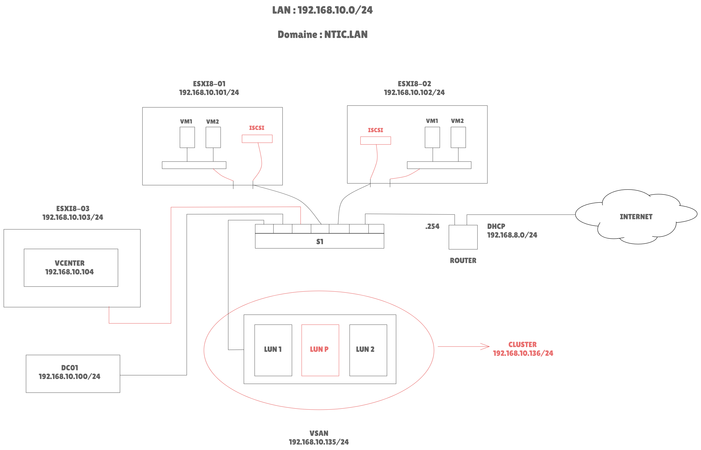


## Configuration du réseau virtuel

NB : Notre PC n’est pas assez puissant pour faire fonctionner toute l’infrastructure.

Nous avons donc utilisé deux Pcs pour faire fonctionner toute l’infrastructure. Chaque PC supportera une ou plusieurs VMs selon ses capacités.

Cas 2 se présentent :

-	Soit on connecte le switch à un pc à l’aide d’un câble console et on accède à l’interface cli du switch grâce à PUTTY et s’assurer que le switch n’a pas de configuration personnalisée (VLAN) PUIS connecter les deux ordinateurs au switch à l’aide d’un câble Ethernet

-	Soit par simplicité on interconnecte directement les deux PCs (sans passer par un switch)  à l’aide d’un câble Ethernet

Dans la barre de recherche cortana ou dans l’invite de commande, saisir ncpa.cpl et identifier la carte réseau ethernet de la machine physique.

edit > virtual network editor > change settings :
-	sélectionner VMnet0 > cocher bridged (connect VMs directly to the external network) > bridged to : Sélectionner la carte réseau ethernet de la machine physique.

-	Sélectionner VMnet8 :
o	 Cocher NAT > Cocher Connect a host virtual adaptater to this network
o	Cocher Use Local DHCP service to distribute IP address to Vms
o	Subnet IP : 192.168.8.0 
o	Subnet mask : 255.255.255.0

Valider


## Configuration du routeur

### Création de la machine virtuelle

```
file > open > sélectionner le fichier DC qui se trouve dans Master2019\DC

faire un full clone de DC : Cliquer droit sur DC > Cliquer sur Manage > Cliquer sur Clone > Suivant > Sélectionner The current state in the virtual machine > suivant > Sélectionner Create a full clone > Suivant > Saisir ROUTER > Terminer > Close

Ajouter une carte réseau et la mettre dans un LAN Segment que l’on nommera LAN.

Pour créer un LAN segment, Sélectionner la carte virtuelle > cocher LAN segment > cliquer sur LAN Segments > cliquer sur Add > Saisir un nom > Valider > Sélectionner le LAN segment qu’on vient de créer.
```

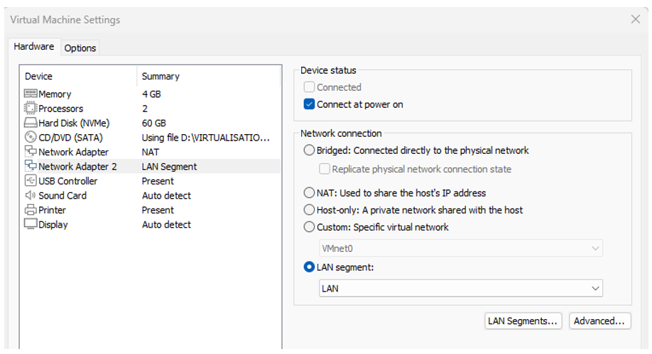


Démarrer la VM et procéder à l'installation


### Changement de nom de la machine :

```
Ouvrir le gestionnaire de serveur > Sélectionner Serveur local > Cliquer sur Nom de l’ordinateur > Cliquer sur Modifier > Nom de l’ordinateur : saisir router > Cliquer sur Ok x 2 > Cliquer sur Fermer > Cliquer sur Redémarrer ultérieurement
```

### Configuration l'interface réseau LAN :

```
Ouvrir les connexion réseaux : dans la barre de recherche cortana, saisir ncpa.cpl
```

**Renommer les cartes réseaux**

```
Renommer les cartes réseau : pour renommer les cartes réseau, cliquer droit sur chaque carte LAN > renommer
Renommer la première carte réseau qui, normalement, est connectée au Wan :  INTERNET et Renommer la carte réseau qui est connectée au réseau local : LAN
```

**Attribution statique d’une adresse IP à la carte LAN :**

```
Clic droit sur la carte LAN > Propriétés > Double cliquer sur Protocole Internet version 4 (TCP/IPv4) > cocher Utiliser l’adresse IP suivante > saisir les données
```

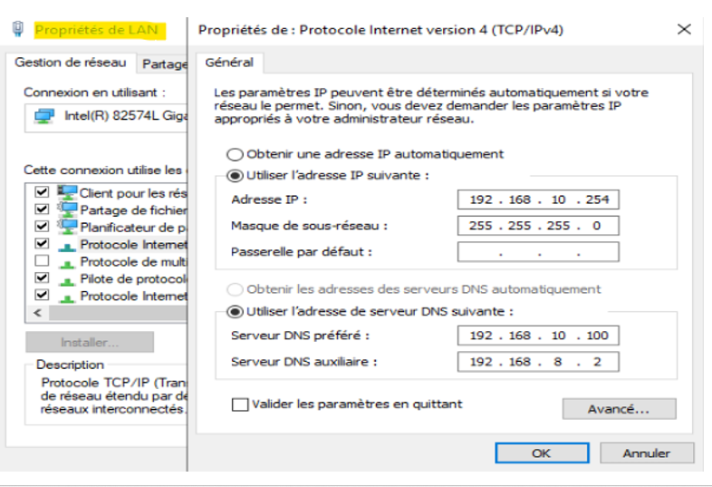

```
Cliquer sur OK > Décocher Protocole Internet version 6 (TCP/IPv6) > Cliquer sur OK > Redémarrer le serveur
```
Ps : Pour information 192.168.8.2 est la passerelle par défaut du NAT configuré automatiquement par VMWare. On le trouve dans edit > virtual network editor > Sélectionner VMnet8 > NAT settings > Voir champs Gateway IP

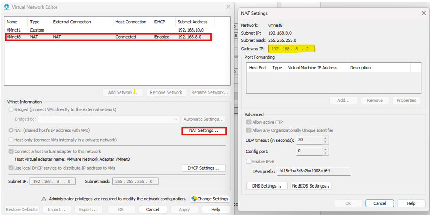

### Installation et configuration du rôle routage :

```
Ouvrir le gestionnaire de serveur > Gérer > Ajout des rôles et des fonctionnalités > suivant x2 > Dans la rubrique Sélection du serveur, s’assurer que l’adresse ip 192.168.10.254 s’affiche, si c’est le cas, cliquer sur suivant > Cocher Accès à distance > Suivant x3 > Cocher routage > Cliquer sur Ajouter des fonctionnalités > suivant x3 > Cocher Redémarrer automatiquement le serveur de destination, si nécessaire > Cliquer sur Oui sur la Pop-up qui s’affiche > Cliquer sur Installer. 

Quand l’installation est terminée, cliquer sur fermer

Cliquer sur le drapeau jaune > Cliquer sur Ouvrir l’assistant de mise en route > cliquer sur Déployer VPN uniquement (Attention, la fenêtre s’affiche derrière le gestionnaire de serveur) > Cliquer droit sur ROUTER (local) > cliquer Configurer et activer le routage et l’accès à distance > cliquer sur suivant > cocher accès VPN (Virtual Private Network) et NAT > suivant > sélectionner INTERNET > suivant x3  > terminer > ok x2
```

### Faire les Mises à jour : 

```
Dans la barre de recherche Cortana, saisir paramètres de Windows Update > cliquer sur Rechercher des mises à jour > Lorsque les mise à jour sont terminées, cliquer sur redémarrer
```

## Configuration de la VM DC 01 

```
Faire un full clone de DC : Cliquer droit sur DC > Cliquer sur Manage > Cliquer sur Clone > Suivant > Sélectionner The current state in the virtual machine > suivant > Sélectionner Create a full clone > Suivant > Saisir DC01 > Terminer > Close
Modifier la carte réseau : la mettre dans le LAN Segment créé plus haut 
```

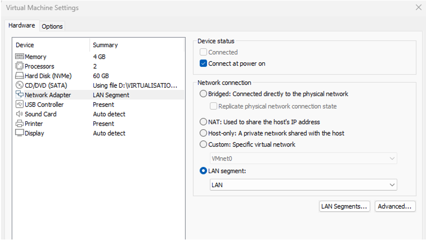


Démarrer la VM et procéder à l'installation

### Changement de nom de la machine :

```
Ouvrir le gestionnaire de serveur > Sélectionner Serveur local > Cliquer sur Nom de l’ordinateur > Cliquer sur Modifier > Nom de l’ordinateur : saisir DC01 > Cliquer sur Ok x 2 > Cliquer sur Fermer > Cliquer sur Redémarrer ultérieurement
```

### Configuration l'interface réseau LAN :

```
Ouvrir les connexion réseaux : dans la barre de recherche cortana, saisir ncpa.cpl 

Renommer la carte réseau: LAN
```

### Configuration statique d’une adresse IP à la carte LAN : 

```
Clic droit sur la carte LAN > Propriétés > Double cliquer sur Protocole Internet version 4 (TCP/IPv4) > cocher Utiliser l’adresse IP suivante > saisir les données (cf. image ci-dessous) > Cliquer sur OK > Décocher Protocole Internet version 6 (TCP/IPv6) > Cliquer sur OK > Clic Droit sur la carte réseau > Désactiver > Clic droit sur la carte réseau > Activer
```
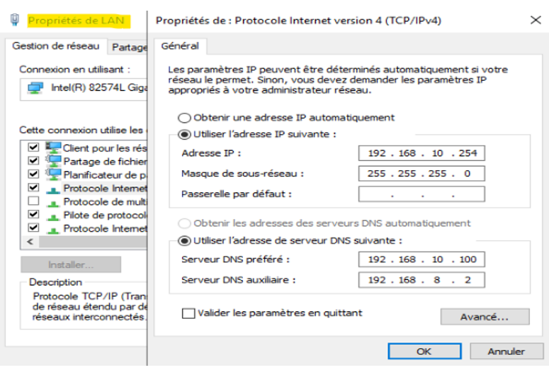

Maintenant la VM doit avoir accès à internet 


Test de connectivité :

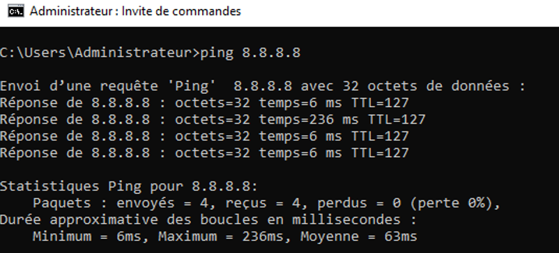

```
Redémarrer le serveur
```

### Faire les Mises à jour :

```
Dans la barre de recherche Cortana, saisir paramètres de Windows Update > cliquer sur Rechercher des mises à jour > Lorsque les mise à jour sont terminées, cliquer sur redémarrer
Normalement on devrait avoir la connectivité internet ; En effet, même si on est sur le réseau LAN, grâce au service de routage mise en place sur la machine virtuelle ROUTER > toutes les machines du réseau LAN auront la connectivité internet.
```

### Installation et configuration du rôle AD DS

```
Ouvrir le gestionnaire de serveur > Gérer > Ajout des rôles et des fonctionnalités > suivant x2 > Dans la rubrique Sélection du serveur, s’assurer que l’adresse ip 192.168.10.100 s’affiche, si c’est le cas, cliquer sur suivant > Cocher Services AD DS > cliquer sur Ajouter des fonctionnalités > suivant x3 > Cocher Redémarrer automatiquement le serveur de destination, si nécessaire > Cliquer sur Oui > Cliquer sur Installer > cliquer sur Fermer lorsque l’installation est terminée.

Cliquer sur le drapeau   > Cliquer sur Promouvoir ce serveur en contrôleur de domaine > Cocher Ajouter une nouvelle forêt > Nom de domaine racine : ntic.lan > cliquer sur Suivant > saisir mot de passe x2 > Suivant x2 > attendre que le nom de domaine NETBIOS s’affiche > suivant x3 > installer > Cliquer sur Fermer > Le serveur va redémarrer.
```
Cette mise en place de l’AD DS modifie la configuration IP de la carte réseau. Il faut donc aller sur la carte réseau pour ressaisir correctement les adresses IP concernant les serveurs DNS.

```
Ouvrir les connexion réseaux : dans la barre de recherche cortana, saisir ncpa.cpl 

Clic droit sur la carte LAN > Propriétés > Double cliquer sur Protocole Internet version 4 (TCP/IPv4) > Dans serveur DNS préféré, remettre : 192.168.10.100 // Dans serveur DNS auxiliaire, remettre : 192.168.8.2 > Cliquer sur ok x2 > Clic droit sur la carte réseau > désactiver > Clic droit sur la carte réseau > activer

S’assurer que la VM a de nouveau accès à internet  
```

Test de connectivité : 

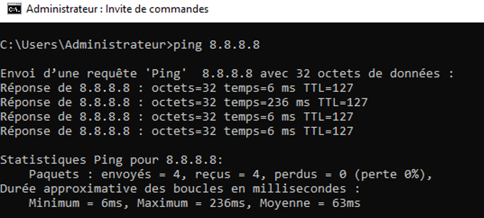


### Configuration de la zone inversée et du pointeur PTR

```
Gestionnaire de serveur > Outils > DNS 

Déplier DC01> clic sur Zones de recherche directe > vérifier que ntic.lan est bien présent
Clic droit sur zone de recherche inversée > nouvelle zone > suivant x4 > ID réseau : saisir 192.168.10 > suivant x2 > terminer

Déplier zone de recherche directe > sélectionner ntic.lan > clic droit sur dc01 > sélectionner propriétés > Cocher Mettre à jour l’enregistrement de pointeur (PTR) associé > Appliquer > ok

Ouvrir l’invite de commande > saisir ipconfig /registerdns > saisir nslookup > vérifier que le serveur par défaut est dc01.ntic.lan avec une adresse ip 192.168.10.100
```

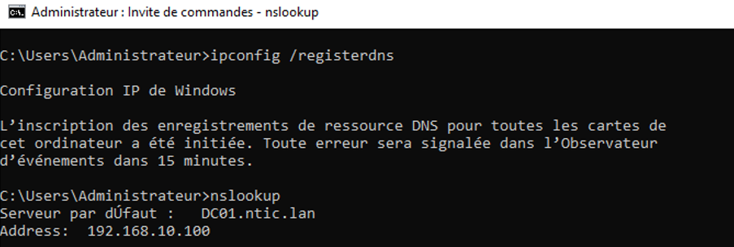


### Installation et configuration du DHCP

```
Ouvrir le gestionnaire de serveur > Gérer > Ajout des rôles et des fonctionnalités > suivant x2 > Dans la rubrique Sélection du serveur, s’assurer que l’adresse ip 192.168.10.100 s’affiche, si c’est le cas, cliquer sur suivant > Cocher Serveur DHCP > Ajouter des fonctionnalités > Suivant x 3 > cocher Redémarrer automatiquement le serveur de destination, si nécessaire > Oui > Installer > Lorsque l’installation est terminée, cliquer sur Fermer

Cliquer sur le drapeau   > cliquer sur Terminer la configuration DHCP > suivant > valider > Fermer

Outils > DHCP > Dérouler dc01.ntic.lan > dérouler IPV4
Clic droit sur IPV4 > cliquer sur Nouvelle Etendue > Suivant > nom : IP_DHCP > Suivant > Adresse IP de début : 192.168.10.1 Adresse IP de fin : 192.168.10.254 > Suivant > Adresse IP de début : 192.168.10.1 Adresse IP de fin : 192.168.10.9 > Ajouter > Adresse IP de début : 192.168.10.100 Adresse IP de fin : 192.168.10.254 > Ajouter > Suivant x3 > Adresse IP : 192.168.10.254 > Ajouter > suivant x4 > terminer 
```

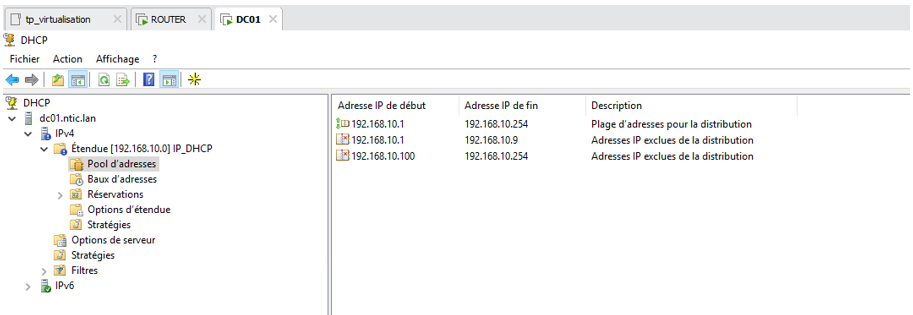

```
Clic droit sur Options d’étendue > configurer les options > vérifier les options sont bien présentes :  003 Routeur, 006 Serveurs DNS et 015 Nom de domaine de DNS. Elles sont indispensables
```

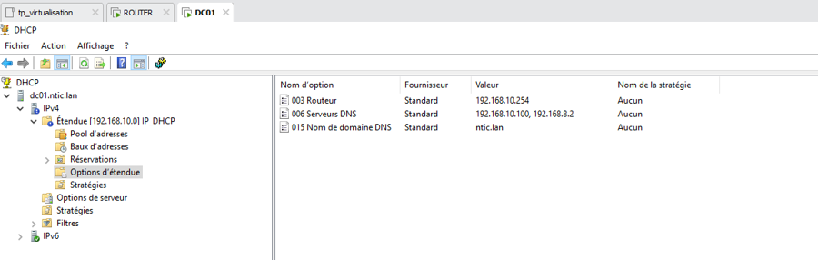


## Installation et configuration des ESXI8-1, ESXI8-2 et ESXI8-3 

```
File > New virtual Machine > Next(X2) > VMware ESX (dernière version) > vitual machine name : ESXI8-1, ESXI8-2 ou ESXI8-3 (selon le cas) > Next > cocher Store virtual disk in a single file > Next > Finish 
```

### Configuration des paramètres de la VM : 

```
•	Settings > Add > Hard Disk > Next x3 > Cocher Store virtual disk as a single file > Next > Finish 
•	CD/DVD > Use ISO image file : Sélectionner VMware-VMvisor-Installer-8.0U1a-21813344.x86_64.iso (Qu’on va récupérer dans le dossier virtualisation) 
•	Processors : cocher Virtualize Intel VT-x/EPT or AMD-V/RVI
•	 Network Adapter > Cocher LAN Segment > Sélectionner LAN > Cliquer sur Ok
•	Cliquer sur l’onglet Options > Advanced > Dans la zone Firmware type :  cocher BIOS
```

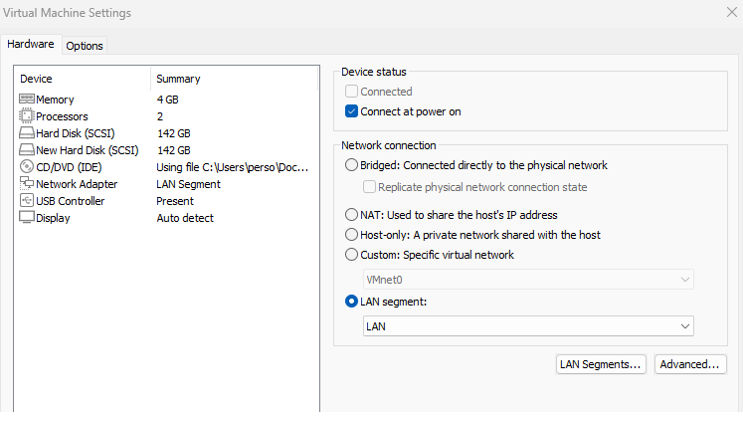

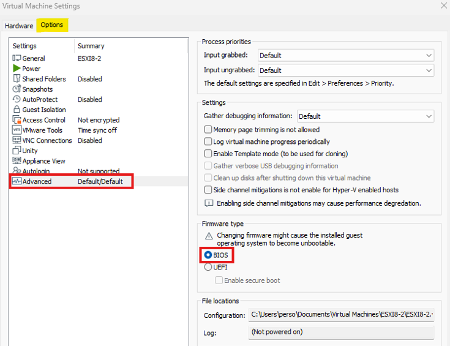

```
•	Lancer la VM :
•	Enter > (F11) > Sélectionner le premier disk > French > P@ssword123 > Enter > (F11) > Enter
```

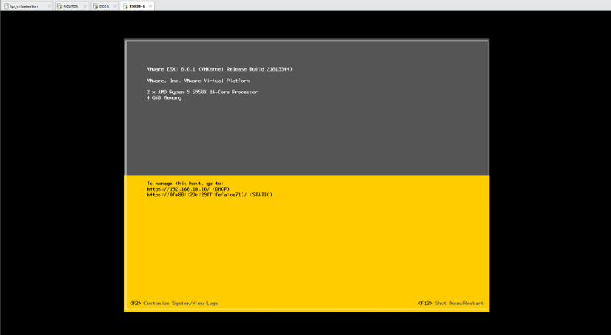


```
•	(F2) > P@ssword123 > Configure management Network > IPV4 Configuration > On cocher Set Static IPv4 address and network configuration > Sur IPV4 address on met :
- 192.168.10.101 pour ESXI8-1
- 192.168.10.102 pour ESXI8-2  
- 192.168.10.103 pour ESXI8-3
> Enter
```

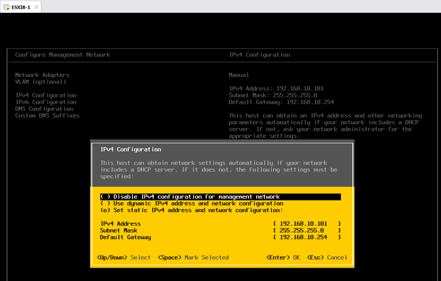

```
•	IPV6 Configuration > On coche Disable IPV6 > Enter 
•	DNS Configuration > Cocher Use the Following DNS server > Hostname ESXI8-1 > Enter > Echap > Yes
```         

Résultat : 

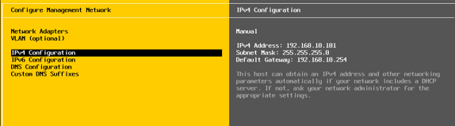

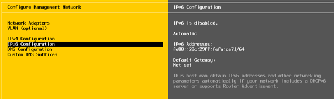

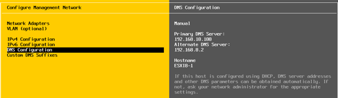

Après le redémarrage, les données saisies précédemment apparaissent :

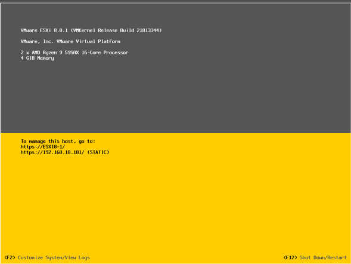

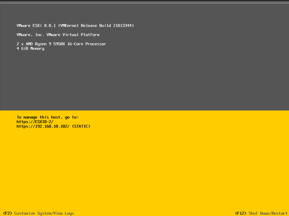

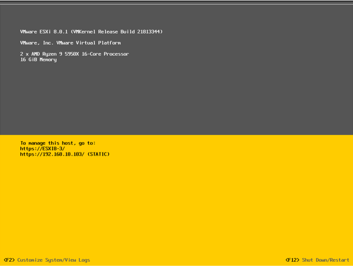


``` 
Ajouter les trois enregistrements dans le contrôleur de domaine DC01 :

Sur la machine virtuelle DC01, aller sur le gestionnaire de serveur > Outils > DNS > Déplier DC01 > Déplier Zones de recherche directe > Clic droit sur ntic.lan > Nouvel hôte (A ou AAAA) > Nom : saisir EXSI8-1, Adresse IP : 192.168.10.101> Cocher Créer un pointeur d’enregistrement PTR associé > Ajouter un hôte

Faire la même procédure pour EXSI8-2 et EXSI8-3
``` 

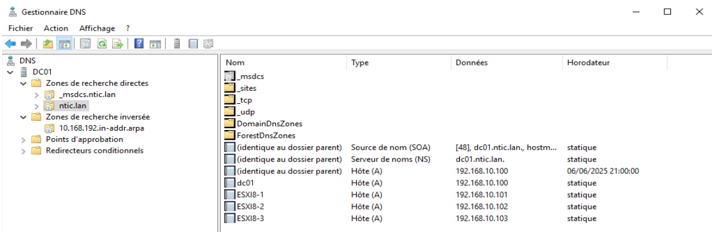


Et dans la zone inversée, on constate que les ajouts ont été effectués


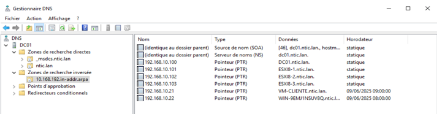


## Installation et configuration du VSAN (Virtual SAN)


### Création de la machine virtuelle VSA

``` 
File > open > virtualisation > Virtual SAN > VSA > Virtual_SAN_Appliance_Trial > OVF > sélectionner le fichier VSA.ovf > Ouvrir > Cocher I Accept the terms of the license agreement > Next > Name for The new virtual Machine : VSA > Import

Mettre la carte réseau sur LAN Segment

Vérification des disques témoin :

Sélectionner le premier disque témoin de 1 go > Cliquer Advanced > Dans Virtual device node, il doit être en SCSI 0:0 Hard Disk (SCSI)

Sélectionner le deuxième disque témoin de 1 go > Cliquer Advanced > Dans Virtual device node, il doit être en SCSI 0:1 Hard Disk (SCSI)

Info : les disques témoin ne vont pas être utilisés pour le stockage. Ils sont juste utiles dans l’architecture pour le bon fonctionnement du VSAN. C’est d’ailleurs pour cette raison qu’ils n’ont qu’une taille d’1 Go.

Ajout de deux disques de stockage :

Ajouter un nouveau disque : cliquer sur Add > Next > SCSI > Next > Create a new virtual disque > Maximum disk size (GB) : 200 > cocher Store virtual disk as a single file > Next > Finish

Sélectionner le nouveau disque que nous venons de créer > Cliquer Advanced > Dans Virtual device node > Sélectionner SCSI 1:0 > Ok 

Ajouter un nouveau disque : cliquer sur Add > Next > SCSI > Next > Create a new virtual disque > Maximum disk size (GB) : 200 > cocher Store virtual disk as a single file > Next > Finish

Sélectionner le nouveau disque que nous venons de créer > Cliquer Advanced > Dans Virtual device node > Sélectionner SCSI 1:1 > Ok

NB : Ces deux disques vont jouer le rôle de stockage

Démarrer la VM et laisser installer.
``` 

###  Configuration de l’adresse IP

``` 
Login : start 	! Attention le clavier est en qwerty) > Entrée x 2

Dans cette interface, utiliser le retour charriot pour effacer // Tabulation pour passer de ligne en ligne // Pour faire le point, utiliser le slash (/)

Sélectionner Network TCP / IP Settings   > Appuer sur la touche  de Tablulation > Entrée > Hostname : vsa > Sélectionner Use the following IP address : IP Address : 192.168.10.135 // Mask : 255.255.255.0 // Gateway : 192.168.10.254 > Sélectionner OK x 3 > Sélectionner OK > Sélectionner Back > Sélectionner Log out
```

###  Installation du logiciel de gestion du SAN :

NB : CMC_8.5.00.0313_Installer.exe (HP LeftHand P4000) est un logiciel de gestion du SAN. Cela évite de gérer le SAN via des lignes de commande. Ce serait complexe.

Pour ce faire, nous allons, dans un premier temps, créer une machine cliente (Windows 11), que nous nommerons VM-CLIENTE. 

Puis, nous allons travailler sur toute l’infrastructure, à distance, depuis cette machine cliente

Attention : Si notre PC physique n’a pas suffisamment de ressources, il ne faut pas créer une nouvelle machine virtuelle. Dans ce cas, on se servira de la VM DC01 pour travailler sur toute l’infrastructure.

#### Création de la VM cliente 

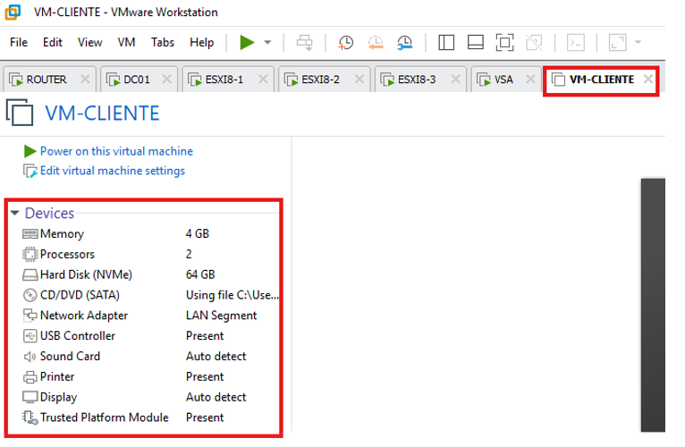

Démarrer la VM et procéder à l’installation > Une fois l’installation terminée > Installer les tools > Renommer le PC si besoin > Vérifier que le PC a la connectivité internet > Faire les mises à jour

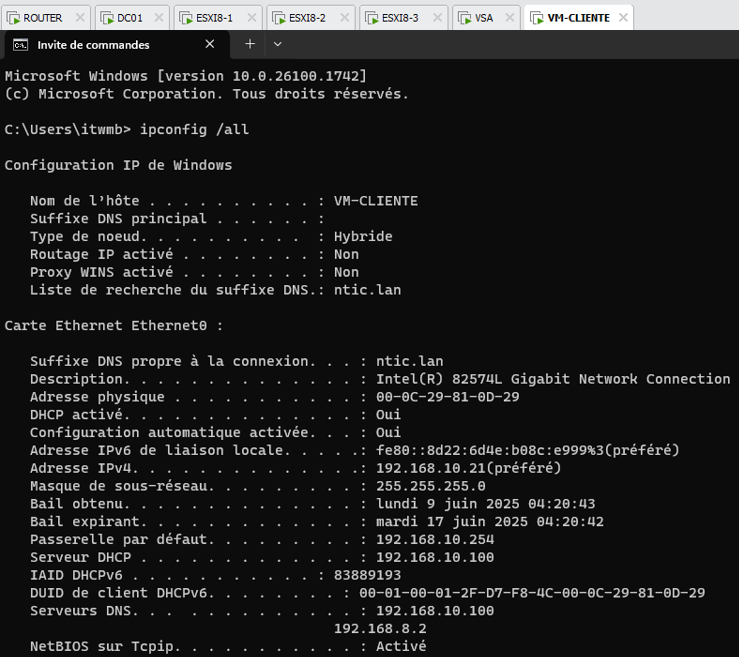

####  Installation du logiciel sur la VM Cliente

```
Copier le fichier CMC_8.5.00.0313_Installer.exe qui se trouve dans Virtualisation > Virtual_SAN > VSA > Virtual_SAN_Appliance_Trial > Centralized_Management_Console > Le coller dans le bureau de la VM-cliente > Exécuter le logiciel > Next > Cocher I accept the terms of the licence agreement > Next x5 > Install > Done > Cliquer sur Autoriser sur la pop-up qui s’affiche.
```

#### Configuration de l’assistant de recherche de nodes pour trouver le SAN qu’on vient de configurer : 

```
Next > Laisser cocher By IP address or Hostname afin d’effectuer la recherche du nœud par son adresse IP > Next > Add > Saisir 192.168.10.135 > Entrée > Sélectionner L’adresse ip qu’on vient de saisir > Cliquer sur Finish > Si tout est correct, L’assistant va trouver le SAN, Cliquer sur Close pour Fermer
```

#### Configuration des disques

```
Cliquer sur Available Nodes > vsa > Storage > Cliquer sur l’onglet Disk setup > On doit normalement voir nos deux disques de 200Go > Cliquer sur le disque 2 (Il est jaune) > Cliquer sur Disk Setup Tasks > Cliquer sur Add Disk to RAID > Cliquer sur Ok > Le disque passera en vert
```

#### Configuration du DNS

```
Cliquer sur TCP/IP network > Cliquer sur l’onglet DNS 
> Cliquer sur DNS Tasks > Edit DNS Domain Name > Saisir ntic.lan > Ok
> cliquer sur DNS Tasks > Edit DNS Servers > 192.168.10.100 > Ok
> cliquer sur DNS Tasks > Edit DNS Suffixes > Saisir ntic.lan > Ok
```

####  Configuration du groupe de gestion du cluster

Ici le but c’est de virtualiser le stockage dans le réseau et assurer l’intégrité des données et leur disponibilité.

```
Cliquer sur Getting started > Cliquer sur Management Groups, Cluster and Volume Wizard > Next > Laisser cocher new Management Group > Next > Management Group Name : Saisir MntGroup > Next >User Name : admin // Password : P@ssword123 // Confirm Password : P@ssword123 > Next > Laisser cocher Use a Network Time Protocol (NTP) Server > Add > Saisir 192.168.10.100 > Ok > Next > Sélectionner Standard Cluster ( ! Si on a plusieurs sites, il faut cocher Multi-Site Cluster) > Next > Cluster Name : ClusterProd > Next > Add > Virtual IP Address : 192.168.10.136 // Subnet Mask : 255.255.255.0 > Ok > Next > Cocher Skip Volume Creation (on ne va pas créer les LUN pour le moment) > Finish > Close > Ok
```

#### Création des volumes :

```
Création du premier volume (qui sera rattaché in fine au stockage de l’ESXI8-1) : Clic droit sur clusterProd > New Volume > Volume Name : LUN1-ESXI1-110Go > Size : 110 > cliquer sur l’onglet Advanced > Cocher Thin (Si on met Full , tout l’espace sera bloqué sur notre disque physique) > Ok

Création du deuxième volume (qui sera rattaché in fine au stockage de l’ESXI8-2) : Clic droit sur clusterProd > New Volume > Volume Name : LUN2-ESXI2-110Go > Size : 110 > cliquer sur l’onglet Advanced > Cocher Thin (Si on met Full, tout l’espace sera bloqué sur notre disque physique) > Ok

Création du volume Partagé : Clic droit sur clusterProd > New Volume > Volume Name : LUN-PARTAGE > Size : 140 > cliquer sur l’onglet Advanced > Cocher Thin (Si on met Full , tout l’espace sera bloqué sur notre disque physique) > Ok
```

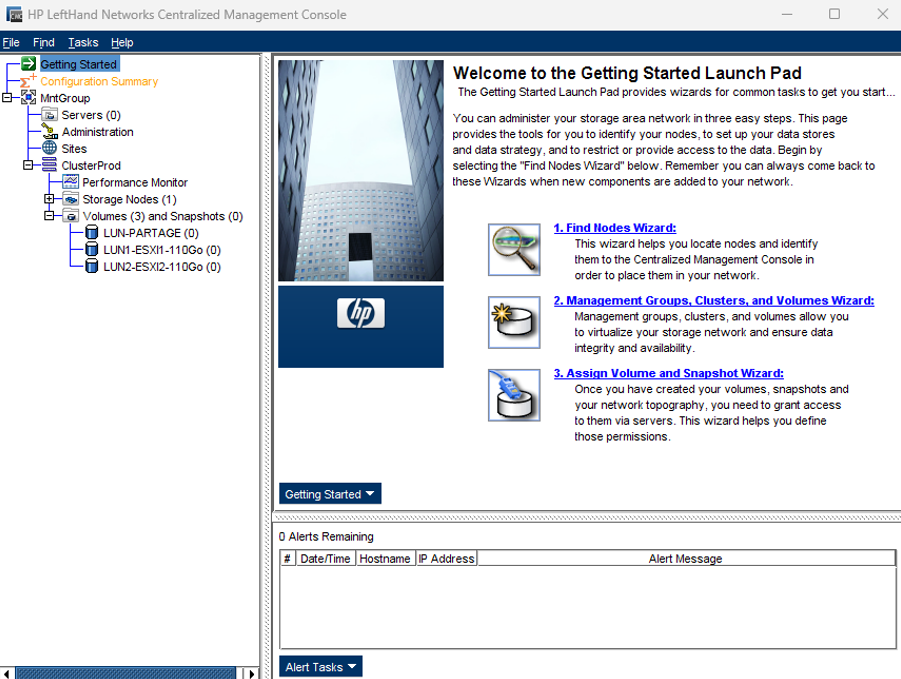


## vCenter : Installation et configuration

### Installation du Vcenter

Il faut copier l’iso VMware-VCSA-all-8.0.1-21860503.iso qui se trouve dans Virtualisation et le coller sur le bureau de la VM-cliente

```
Faire un clic droit sur l’iso > Sélectionner Monter > Ouvrir le dossier vcsa-ui-installer afin d’installer l’interface graphique > Win32 > cliquer sur Installer > ne rien faire de plus pour le moment

Se connecter à l’ESXI8-3 : http://192.168.10.103 > Avancé > Continuer sur vers 192.168.10.103 (non sécurisé) > Nom d’utilisateur : root // Password : P@ssword123 > Connexion > Ok x2

Renommer le stockage : Sélectionner Stockage > Cliquer sur datastore1> Cliquer sur Actions > Renommer > Nouveau nom : disk1 > Enregistrer

Augmenter la capacité du stockage : Cliquer sur Augmenter la capacité > Suivant x2 > La machine étant récente on laisse VMFS6, sinon on aurait choisi une autre version > Suivant > Terminer > Oui

Revenir sur la fenêtre d’installation du Vcenter > Cliquer sur Install > Next > Cocher I accept the terms of the license agreement > Next > ESXI host or vCenter Server name : 192.168.10.103 // HTTPS port : 443 // User name : root // Password : P@ssword123 > Next > Yes > VM name : vcenter // Set root password : P@ssword123 // Confirm root password : P@ssword123 > Next > Deployment Size : Tiny (Parce que notre infrastructrure est très petite) > Next > Cocher Enable Thin Disk Mode (c’est le mode virtuel. Il va utiliser uniquement la place où il y a les données) > Next > IP address : 192.168.10.104 // Subnet mask : 255.255.255.0 // Default Gateway : 192.168.10.254 // DNS servers : 192.168.10.100, 192.168.8.2 > Next > Finish 

Quand l’installation est terminée, cliquer sur Continue > Next > Time synchronization mode : sélectionner Synchronize time with the NTP servers // NTP servers (comma-separated-list) : 192.168.10.100 > Next > Single Sign-On domain name : vsphere.local // Single Sign-On password : P@ssword123 // Confirm password : P@ssword123 > Next x2 > Finish > Ok > Cliquer sur https://VCENTER.ntic.lan:443 > Avancé > continuer vers vcenter.ntic.lan (non sécurisé) > Lancer vspere client > administrator@vsphere.local // P@ssword123  > Connexion
```

### Création d’un nouveau centre de données :

```
Clic droit sur VCENTER.ntic.lan > Nouveau centre de données… > Nom : DataParis > Ok 

Ajouter l’hôte ESXI8-1 : Clic droit sur DataParis > Ajouter un hôte > Nom d’hôte ou adresse IP : esxi8-1.ntic.lan > Suivant > Nom d’utilisateur : Root // Mot de passe : P@ssword123 > Suivant > Oui > Suivant > Décocher Manage host with an image > Suivant x4 > Terminer

Ajouter l’hôte ESXI8-2 : Clic droit sur DataParis > Ajouter un hôte > Nom d’hôte ou adresse IP : esxi8-2.ntic.lan > Suivant > Nom d’utilisateur : Root // Mot de passe : P@ssword123 > Suivant > Oui > Suivant > Décocher Manage host with an image > Suivant x4 > Terminer

On peut voir que les deux ESXI sont bien remontées dans Vcenter

On va les renommer :

• Clic droit sur Datastore1 qui correspond au stockage de l’esxi8-1 > Renommer > Saisir esxi8-1.ntic.lan > Ok

• Clic droit sur Datastore1 (1) qui correspond au stockage de l’esxi8-2 > Renommer > Saisir esxi8-2.ntic.lan > Ok

Rafraichir la page
```


### Installer une Machine virtuelle sur l’ESXI8-1 : 

```
Télécharger l’image iso :

Sur la VM-cliente, télécharger l’iso d’un système d’exploitation (Windows Server 2022, Windows 11, Debian 12 etc.) > ensuite se connecter sur l’interface de gestion de l’ESXI8-1 : Dans le navigateur, saisir http://192.168.10.101 > Avancé > Continuer vers 192.168.10.101 (non sécurisé) > Saisir les identifiants de connexion : administrator@vsphere.local // P@ssword123 > Connexion


Cliquer sur l’icône stockage   > datastore1 > Explorateur de banque de données > Créer un répertoire > Nom du répertoire : iso > Cliquer sur Créer un répertoire > Cliquer sur Télécharger > Sélectionner un fichier iso > Cliquer sur Ouvrir > Attendre que le chargement du fichier se termine et cliquer sur fermer
```

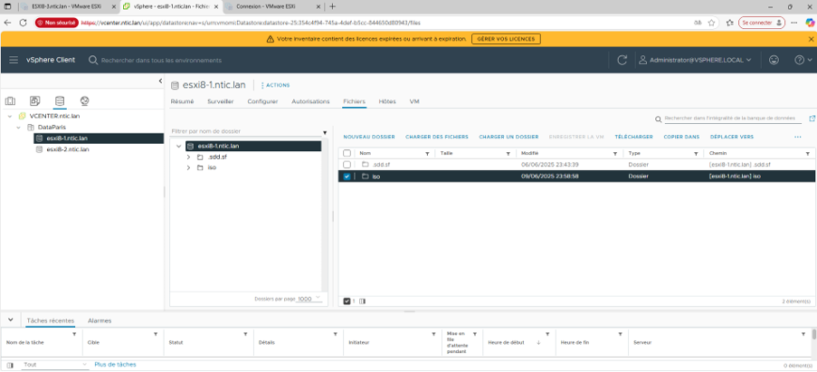


```
Cliquer droit sur esxi8-1.ntic.lan > Nouvelle machine virtuelle > Suivant > Nom de la machine virtuelle : VM1 > Sélectionner esxi8-1.ntic.lan > Suivant x2 > Cocher disk1 > Suivant x2 > Version du système d’exploitation : Sélectionner la version correspondante à l’iso (Dans notre cas, c’est Microsoft server 2012) > Suivant > Dans Nouveau lecteur CD/DVD : sélectionner Fichier ISO banque de données > Sélectionner disk1> Sélectionner le dossier ISO > cocher le fichier ISO > Ok > Cocher Connecter lors de la mise sous tension > Suivant > Terminer

Mettre sous tension : Clic Droit sur VM1 > Alimentation > Mettre sous tension

Procéder à l’installation du système d’exploitation > Une fois l’installation terminée, renommer la machine > La mettre dans le domaine 

Installer VMWare Tools : Cliquer sur Actions > Installation de VMWare Tools > Aller sur la VM > cliquer sur Lecteur CD/DVD et Exécuter > Suivant x2 > Installer > Redémarrer la VM
```
Il faudra donc au final installer selon la procédure ci-dessus deux VMs (VM1 et VM2) sur l’ESXI8-1 et deux VM sur l’ESXI8-2 (VM1 et VM2)


## Configuration du stockage en réseau

Le but c’est que les deux esxi aient le stockage sur le réseau

Se connecter à https://vcenter.ntic.lan:443

```
Cliquer sur esxi8-1.ntic.lan > Cliquer sur Adaptateurs de stockage > cliquer sur Ajouter un adaptateur logiciel > Cliquer sur Ajouter un adaptateur ISCSI > OK
Dans l’onglet Propriétés qui se trouve en bas, aller sur le champ Nom ISCSI et noter le com. Dans notre exemple le nom c’est iqn.1998-01.com.vmware:esxi8-1.ntic.lan:1462349822:65

Cliquer sur esxi8-2.ntic.lan > Cliquer sur Adaptateurs de stockage > cliquer sur Ajouter un adaptateur logiciel > Cliquer sur Ajouter un adaptateur ISCSI > OK
Dans l’onglet Propriétés qui se trouve en bas, aller sur le champ Nom ISCSI et noter le com. Dans notre exemple le nom c’est iqn.1998-01.com.vmware:esxi8-2.ntic.lan:23072631:65


Aller sur le VSAN > Dans l’arborescence, Cliquer droit sur Servers (0) > New Server > Name : esxi8-1 // Initiator Node Name : iqn.1998-01.com.vmware:esxi8-1.ntic.lan:1462349822:65 > Ok 

Cliquer droit sur esxi8-1 > Assign and Unassign Volume and Snapshots… > Cocher LUN PARTAGE et LUN1-ESXI1-110Go > Ok

Cliquer droit sur Servers (1) > New Server > Name : esxi8-2 // Initiator Node Name : iqn.1998-01.com.vmware:esxi8-2.ntic.lan:23072631:65 > Ok

Cliquer droit sur esxi8-2 > Assign and Unassign Volume and Snapshots… > Cocher LUN PARTAGE et LUN2-ESXI1-110Go > Ok > Continuer

Revenir sur le Vcenter > Sélectionner esxi8-1.ntic.lan > Adaptateurs de stockage > Sélectionner l’adaptateur iscsi qu’on a créé précédemment > Tout en bas cliquer sur Découverte dynamique > Cliquer sur Ajouter > Serveur ISCSI, mettre l’adresse du Cluster : 192.168.10.136 > OK >Cliquer sur Réanalyser le stockage > OK >  Cliquer sur découverte statique > On constate que le LUN partage et le LUN ESXI-1 ont été importés

Aller dans l’onglet banque de données (tout en haut) > On voit qu’il y ‘a un disque > Cliquer sur Actions > Stockage > Nouvelle banque de données > Suivant > Nom : LUN1-ESXI8-1-110 // cocher le premier stockage (qui a 110 Go) > Suivant > Laisser cocher VMFS 6 (c’est la dernière version donc elle est plus sécurisée) > Suivant > Suivant > Terminer > On voit que le LUN va apparaitre. Désormais c’est comme si c’était un disque dur local alors que c’est sur une autre machine

Cliquer sur Actions > Stockage > Nouvelle banque de données > Suivant > Nom : LUN-PARTAGE // cocher le stockage > Suivant > Laisser cocher VMFS 6 (c’est la dernière version donc elle est plus sécurisée) > Suivant > Suivant > Terminer > Dans l’onglet banque de données, on voit que le LUN-PARTAGE va apparaitre. 
```

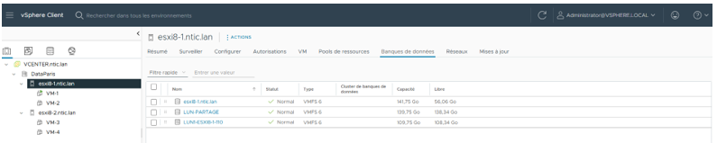

```
Sélectionner esxi8-2.ntic.lan > Adaptateurs de stockage > Sélectionner l’adaptateur iscsi qu’on a créé précédemment > Tout en bas cliquer sur Découverte dynamique > Cliquer sur Ajouter > Serveur ISCSI, mettre l’adresse du Cluster : 192.168.10.136 > OK > Cliquer sur Réanalyser le stockage > OK > Cliquer sur découverte statique > On constate que le LUN partage et le LUN ESXI-2 ont été importés.
Aller dans l’onglet banque de données > On voit qu’il y ‘a un disque et le disque partagé (parce qu’il est partagé, comme il a été importé sur l’exsi8-1, il apparait sur l’esxi8-2 > Cliquer sur Actions > Stockage > Nouvelle banque de données > Suivant > Nom : LUN1-ESXI8-2-110 // cocher le premier stockage (qui a 110 Go) > Suivant > Laisser cocher VMFS 6 (c’est la dernière version donc elle est plus sécurisée) > Suivant > Suivant > Terminer > Dans l’onglet banque de données, on voit que le LUN va apparaitre. 
```

Désormais c’est comme si c’était un disque dur local alors que c’est sur une autre machine.

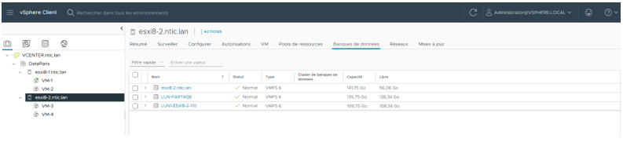


## Activation Vmotion

```
Clic droit sur esxi8-1.ntic.lan > Cliquer sur Adaptateurs VMkernel > cliquer sur les trois petits points verticaux > cliquer sur Modifier > Cocher vMotion > OK
```

## Déplacement d’une VM d’un hôte vers un autre

Exemple : déplacement de la VM-1 sui se trouve sur l’esxi8-1.ntic.lan vers l’esxi8-2.ntic.lan

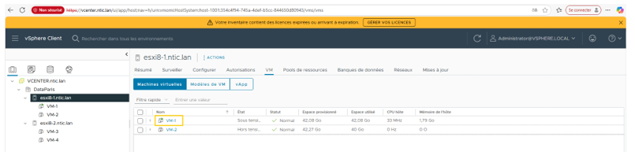

Pour qu’une VM se déplace, il y ‘ a deux conditions :
-	Les esxi doivent être dans le même réseau
-	La VM ne doit pas être connectée physiquement à un fichier ISO

```
Clic droit sur la VM-1 > Modifier les paramètres > Lecteur CD/DVD1 doit être sur Périphérique client (Il ne faut pas qu’il soit sur Fichier ISO, afin qu’il puisse se déplacer quand il veut. Qu’il n’ait pas d’attache quelque part) > Ok > Double cliquer sur VM-01 afin que l’écran s’ouvre en grand > Se connecter > Ouvrir Powershell et saisir les commandes suivantes pour activer les règles FPS via PowerShell : 
```

```bash
Get-NetFirewallRule *fps* | Enable-NetFirewallRule
```

```bash
Get-NetFirewallRule *fps* | Format-Table name , enabled
```

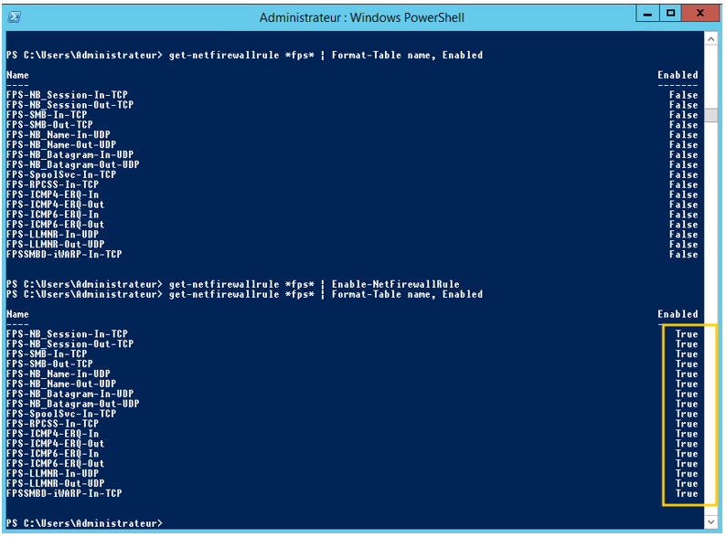

Ouvrir l’invite de commande et saisir ipconfig /all pour récupérer l’adresse ip

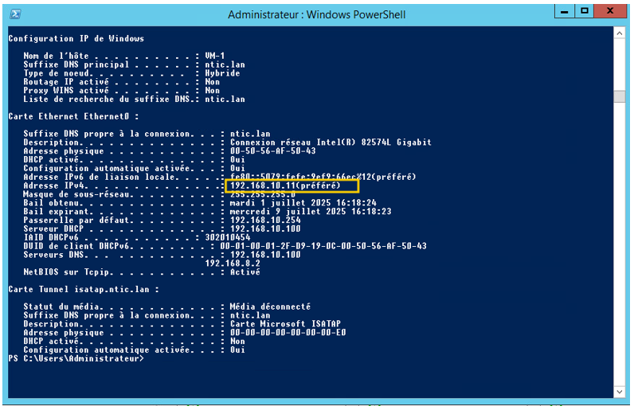

Aller sur le controleur de domaine DC01 > Ouvrir l’invite de commande et pinguer l’adresse IP de VM-1 : 

```bash
ping 192.168.10.11 -t
```

Revenir sur vCenter > Clic droit sur VM-1 > Migrer > Cocher la ressource de calcul et le stockage > Suivant > Déplier jusqu’au bout et sélectionner esxi02.ntic.org > Suivant > Cocher LUN-Partage > Suivant x3 > Terminer 

Revenir sur le DC01 qui est toujours entrain de pinguer.
Est-ce qu’il va continuer de pinguer ou s’arréter alors que la migration est en cours ? Réponse : Il va continuer de pinguer. Donc il n’ya pas eu d’interruption des services
Revenir sur Vcenter, et vérifier que la migration est terminée et que la vm est passée à l’esxi-1

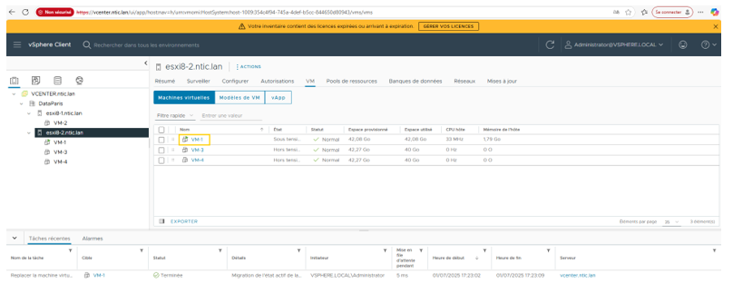